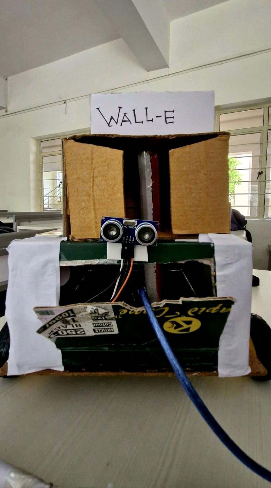

# WALL-E – Autonomous Waste Cleaning Rover

**WALL-E** is an embedded robotics project designed to automate human waste cleaning tasks, reducing the need for manual labor in hazardous environments. It uses sensors to detect waste levels and automates suction, valve control, and movement, all remotely operated via wireless modules.

## 💡 Project Description

The system integrates an ultrasonic sensor with a suction pipe controlled by a servo motor. When waste depth crosses a threshold, the system locks the suction valve and initiates cleaning. All components are controlled via an Arduino and ESP32 microcontroller, enabling real-time sensor feedback and remote navigation.

## 📦 Folder Structure

WALL-E-Rover/
├── README.md
├── circuit diagram.jpg
├── code/
│ └── wall_e_code.ino
├── images/
│ └── images of prototype

## ⚙️ Tech Stack

- Arduino UNO
- ESP32 (for wireless communication)
- Ultrasonic Sensor (HC-SR04)
- Servo Motor (valve control)
- Motor Driver (L298N or similar)
- Embedded C / Arduino IDE

## 🛠 Features

- 🚰 **Depth sensing** for accurate waste detection
- 🔒 **Automated valve control** using servo
- 🚗 **Mobile-controlled rover navigation**
- 🔋 Compact and low-power design

## 🖼 Prototype Preview

---

> 🧪 Developed as an innovation to improve sanitation standards through automation and embedded systems.

By,
Aswin E - aswinelaiya@gmail.com